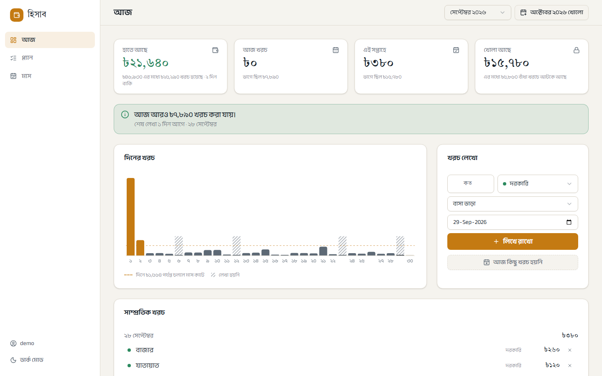
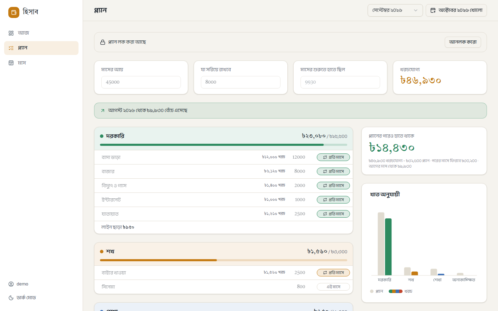
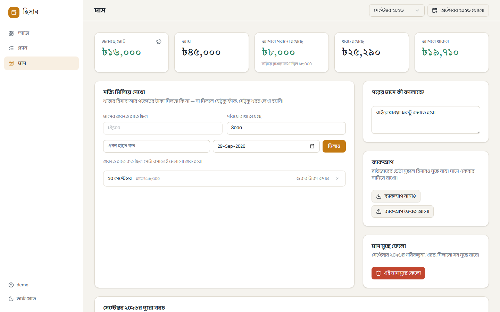
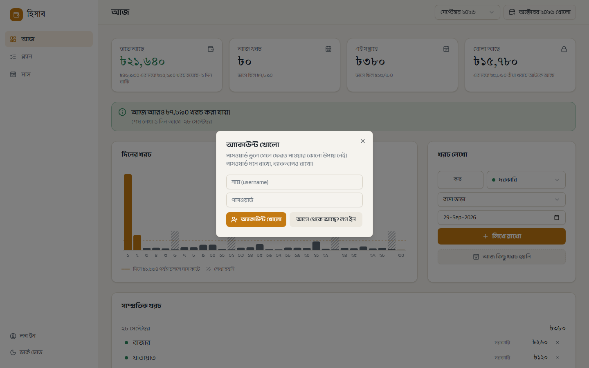

# হিসাব · Hishab

A monthly budget planner and daily spending log with a Bangla interface. It is built on the Japanese *kakeibo* method. Savings come out first, and the rest is split across four categories. You write down what you spend each day and check your cash against the ledger.

The app runs in the browser and saves data in `localStorage`. An optional account (username and password) syncs data to a Postgres database.

## Screenshots









## Features

- **Today dashboard:** shows money left, today's and this week's spending against their allowance, and how much is free versus tied up in fixed costs. A daily spending chart marks days you haven't logged.
- **Plan:** set income and savings, then add budget lines in four categories: দরকারি (needs), শখ (wants), শেখা (learning) and অনাকাঙ্ক্ষিত (unexpected). Mark each line as every month or this month only. Spending is tracked against each line.
- **Safe to spend:** the daily and weekly allowance leave out repeating costs you haven't paid yet, so a bill that's still due isn't counted as free money.
- **Carry-over:** what was left from, or overspent in, last month is added to this month.
- **Reconcile:** enter the cash you actually have. Any gap against the ledger can be logged as one unknown expense.
- **Month review:** total saved, a recap of the month, and a note for next month.
- **Backup:** export all your data to JSON, and import it again.
- **Account sync:** sign up with a username and password to keep data on the server and use it on other devices. There is no password reset.
- Light and dark themes, with a phone layout.

## Tech stack

React 19, TypeScript, Vite, Tailwind CSS 4, shadcn/ui (Radix), Recharts, Vitest.

## Getting started

Requires Node 22.12 or newer.

```sh
npm install
npm run dev      # start the dev server
npm run test     # run unit tests
npm run build    # type-check and build into dist/
npm run preview  # serve the production build
```

Account sync needs the API in `api/`, which runs as Vercel functions against Neon Postgres. Create the tables with `db/schema.sql`, set `DATABASE_URL`, and run `npx vercel dev` to serve the app and API together.

## Project structure

```
api/            Vercel functions: signup, login, logout, month sync
db/             Postgres schema
src/
  lib/          pure logic: dates, formatting, the money model, storage
  state/        reducer and context holding the app state
  components/   shared UI, charts, layout (sidebar, top bar)
  views/        Today, Plan, Month pages
```

All money calculations live in `src/lib/model.ts` (`derive`), and the tests are in `src/lib/model.test.ts`.

## Data

- Saved in `localStorage` under the key `hishab`. The theme choice is saved under `hishab-theme`.
- Without an account, data stays in the browser it was entered in. Clearing site data deletes it.
- With an account, each month is gzipped in the browser and stored as one row in Postgres. The last edit to a month wins. Sync state is kept under `hishab-sync`.
- Export a backup regularly: মাস → ব্যাকআপ → ব্যাকআপ নামাও.
